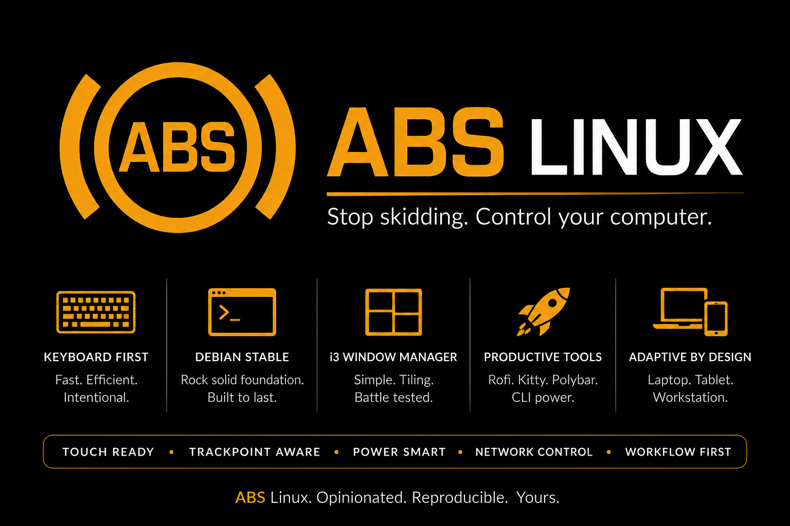

<p align="center">
  
</p>

# ABS Linux

> **Stop skidding. Control your computer.**

ABS Linux is a curated Debian-based Linux desktop distribution built around **i3**,
designed to remain understandable, controllable, hardware-adaptive, and close to
upstream **Debian 13 Stable**. Debian supplies the package base and standard system
mechanisms; ABS supplies desktop integration, capability profiles, and a
Calamares/live-image installation path.

ABS does not fork Debian or maintain an independent Debian package base.

## Philosophy

- Keep Debian Stable underneath and preserve its standard mechanisms.
- Make i3 productive out of the box for keyboards, mice, TrackPoints, touchscreens, and tablets.
- Prefer mature upstream software from Debian over bespoke replacements.
- Keep configuration direct, inspectable, and portable.
- Detect hardware capabilities instead of encoding machine names.
- Produce the same coherent experience across laptops, rugged tablets, and workstations.
- Make setup reproducible and, wherever practical, idempotent.

## Goals

- Turn a clean Debian installation into a consistent ABS workstation through a reviewable bootstrap process.
- Provide thoughtful defaults and integration for a modern i3 desktop.
- Compose features from detected capabilities such as batteries, touchscreens, TrackPoints, rotation sensors, hardware buttons, and multiple displays.
- Support specialized interfaces—including a future LCARS-style touch launcher—without coupling them to the generic i3 configuration.
- Remain close enough to standard Debian that an experienced Linux user can understand and maintain the system.

## Non-goals

- Forking Debian, maintaining an independent package base, or replacing Debian's operating-system foundations.
- Modifying `/etc/os-release` to present ABS Linux as an independent distribution.
- Reimplementing well-maintained upstream tools without a compelling integration need.
- Hostname-specific behavior for known development machines.
- Supporting every possible workflow or desktop environment.

## Architecture

```text
Debian Stable
    ↓
systemd / NetworkManager / PipeWire / standard Debian plumbing
    ↓
X11
    ↓
i3
    ↓
i3bar/i3blocks + Rofi + Dunst
    ↓
ABS Linux configuration, scripts, themes, profiles, and integration
```

Debian remains responsible for boot, packages, services, hardware enablement, and other operating-system foundations. i3 is the primary window manager. ABS owns the configuration and integration that make the pieces feel like one desktop. See [Architecture](docs/architecture.md).

## Hardware-adaptive design

Behavior is driven by capabilities, not hostnames. The read-only `scripts/abs-capabilities` detector exposes facts such as:

```text
touchscreen=true
tablet_mode=true
battery=true
trackpoint=true
rotation_sensor=true
hardware_buttons=true
multi_monitor=true
```

An external Lenovo USB TrackPoint keyboard should receive TrackPoint tuning even on a Dell workstation. A battery should enable battery UI; a desktop without one should not show it. Touch and rotation controls should appear only when the related hardware is present. Machine-specific profiles are reserved for genuine quirks that generic detection cannot express cleanly. See [Hardware detection](docs/hardware-detection.md).

## Core components

The foundation uses i3, i3bar/i3blocks, Rofi, Dunst, Kitty, NetworkManager,
PipeWire, pavucontrol, Fastfetch, screen locking and screenshots. New images use
LightDM; manual deployment preserves the existing display manager. Battery,
Bluetooth and touchscreen behavior depend on capabilities. Development and
optional packages are listed separately and excluded from defaults.

The working reference uses i3blocks; [ADR 0001](docs/adr-0001-i3blocks.md) explains
why this supersedes the old Polybar plan. LCARS, automatic rotation, custom
TrackPoint tuning and hibernation remain future integrations.

## Repository structure

```text
.
├── ABSLinux_hero_ad.png  # Existing project hero artwork
├── assets/               # Future project artwork and screenshots
├── bootstrap/            # Shared deployment and package manifests
├── build/                # live-build scripts; generated output is ignored
├── installer/calamares/  # Upstream installer configuration and ABS branding
├── config/               # Application configuration and Fastfetch branding
├── docs/                 # Architecture, capability strategy, and roadmap
├── LICENSE               # GPL-3.0 license text
├── LICENSES/             # Additional license texts, including CC0-1.0
├── profiles/             # Capability-oriented configuration composition
├── scripts/              # Runtime and maintenance utilities
└── tests/                # Validation and automated tests
```

Subdirectories are added when they contain an implementation or documentation; the repository intentionally avoids empty placeholder trees.

## Project status

**ABS Linux has an implemented installer foundation, not a validated release.**
Calamares settings, branding, deployment, live-build staging and safe tests are
implemented. No ISO or completed VM installation is claimed yet. Follow the
[build and VM guide](build/README.md) for the next acceptance gate, and the
[roadmap](docs/roadmap.md) for remaining work.

### Development and test hardware

The initial test fleet covers different capability classes:

- Getac K120 G2 rugged touchscreen/tablet laptop
- Lenovo ThinkPad T440s with TrackPoint
- Dell Precision T7810 workstation, sometimes with an external Lenovo TrackPoint keyboard

These systems are test platforms only. Their machine identity must never select features; detected hardware capabilities do that.

## Build and installation

```sh
./tests/run.sh
./build/build-iso.sh --check
./build/build-iso.sh --prepare-only
./build/build-iso.sh --build
```

Install the documented build prerequisites first. Builds create isolated output
under `build/output`; they never flash a disk. The initial VM target is UEFI/GPT/
ext4 with Secure Boot disabled. See [Build and VM testing](build/README.md).

For an existing Debian 13 account:

```sh
./bootstrap/install.sh --user YOUR_USER  # read-only plan
sudo ./bootstrap/install.sh --user YOUR_USER --install-packages --apply
```

Read [Manual deployment](bootstrap/README.md) first. Existing user configuration
conflicts stop deployment before writes. Start with a fresh account for testing.
Both paths use the [same deployment architecture](docs/installer-architecture.md).
The [reference inventory](docs/reference-inventory.md) distinguishes working
Defuser behavior from deliberate portable defaults and deferred integrations.

## Contributing

Issues and focused pull requests are welcome while conventions settle. Please keep changes understandable, capability-driven, upstream-first, and safe to rerun. Avoid hostname checks, committed machine-local state, and broad system modifications. New executable scripts should use appropriate strict Bash practices and include `SPDX-License-Identifier: GPL-3.0-or-later`.

When adding a dependency, prefer a maintained Debian package and document why it is needed. When adding hardware behavior, include a generic detection strategy and test expectations.

## Licensing

Original ABS Linux software—including code, executable scripts, and software-oriented configuration—is licensed under **GNU GPL v3 or later** (`GPL-3.0-or-later`). See [LICENSE](LICENSE).

Original ABS Linux artwork and branding—including logos and wallpapers—is dedicated under **Creative Commons Zero v1.0 Universal** (`CC0-1.0`). See [LICENSES/CC0-1.0.txt](LICENSES/CC0-1.0.txt). This dedication does **not** apply to third-party assets; those retain their respective licenses and must be identified separately.

Debian and all other upstream components retain their own copyrights, trademarks, and licenses. ABS Linux does not own or relicense Debian or upstream software.

## Debian attribution and disclaimer

ABS Linux is an independent project based on Debian GNU/Linux. It is **not affiliated with or endorsed by the Debian Project**. Debian is a trademark of Software in the Public Interest, Inc.; use of the name here describes the upstream operating-system base.
